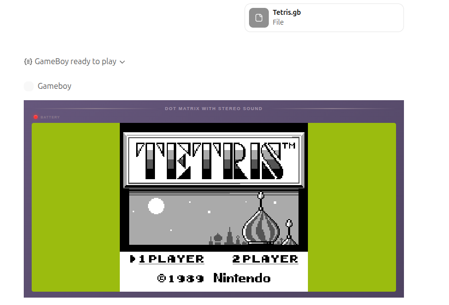
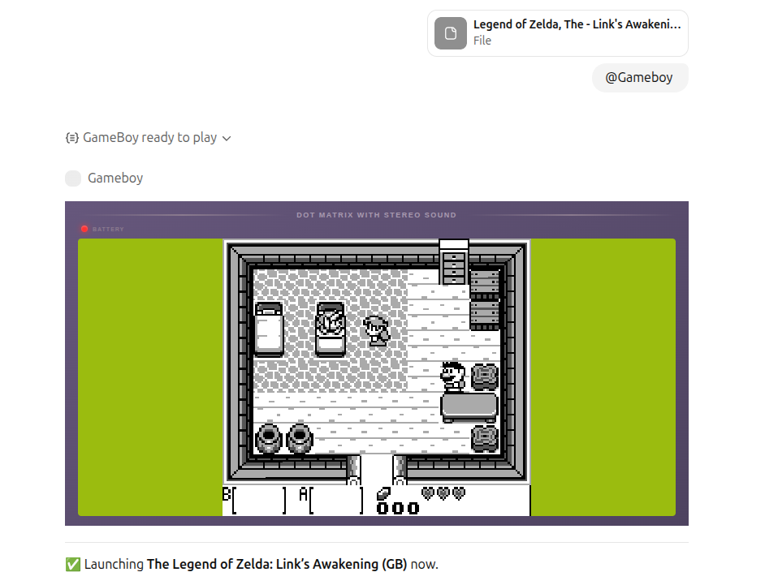

<p align="center">
  
</p>

<h1 align="center">Game Boy Emulator for ChatGPT</h1>

<p align="center">
  <strong>Play classic Game Boy games directly in your ChatGPT conversations</strong>
</p>

<p align="center">
  
  
  
  
</p>

<p align="center">
  <code>https://gameboy.manifest.build/mcp</code>
</p>

---

## Use it in ChatGPT

1. Click on your name, then **Settings** → **Apps** → **Advanced settings** and enable developer mode
2. Go back, click **Create an app**, name it "GameBoy", paste the MCP server URL above, select "No auth" and check the box
3. Start a new chat with `@GameBoy`, attach your ROM file (`.gb`, `.gbc`) and play!

This fun experiment was made by the [Manifest](https://manifest.build) team — reach out if you'd like your app in ChatGPT too.

---

## Screenshots

<p align="center">
  
</p>

<p align="center">
  
</p>

---

## Controls

<table align="center">
  <tr>
    <th>Key</th>
    <th>Action</th>
  </tr>
  <tr>
    <td align="center"><kbd>↑</kbd> <kbd>↓</kbd> <kbd>←</kbd> <kbd>→</kbd></td>
    <td>D-Pad</td>
  </tr>
  <tr>
    <td align="center"><kbd>G</kbd></td>
    <td>A Button</td>
  </tr>
  <tr>
    <td align="center"><kbd>B</kbd></td>
    <td>B Button</td>
  </tr>
  <tr>
    <td align="center"><kbd>H</kbd></td>
    <td>START</td>
  </tr>
  <tr>
    <td align="center"><kbd>N</kbd></td>
    <td>SELECT</td>
  </tr>
</table>

---

## Disclaimer

> **Note:** This emulator does not include any games. You must provide your own ROM files. Please only use ROM files for games you legally own. Support game developers by purchasing official releases.

---

## Features

| Feature                    | Description                                          |
| -------------------------- | ---------------------------------------------------- |
| **Browser-based Emulator** | Full Game Boy emulation embedded directly in ChatGPT |
| **ROM Support**            | Upload `.gb` and `.gbc` ROM files                    |
| **Keyboard Controls**      | Play using intuitive keyboard mappings               |
| **Session Management**     | State persists across your conversation              |

---

## Installation

```bash
npm install
```

---

## Usage

### Development

```bash
npm run dev
```

> Starts the server with hot reload using nodemon.

### Production

```bash
npm run build
npm start
```

### Configuration

Set the `PORT` environment variable to customize the server port (defaults to 3000):

```bash
PORT=8080 npm start
```

---

## Tech Stack

<table>
  <tr>
    <td><strong>Backend</strong></td>
    <td>Node.js • TypeScript • Express • MCP SDK • Zod</td>
  </tr>
  <tr>
    <td><strong>Frontend</strong></td>
    <td>TypeScript • Vite • GameBoy.js • HTML5 Canvas</td>
  </tr>
</table>

---

## Credits

Built with [GameBoy.js](https://github.com/juchi/gameboy.js/) and [CSS GameBoy](https://github.com/attackemartin/css-gameboy).

---

## License

MIT
